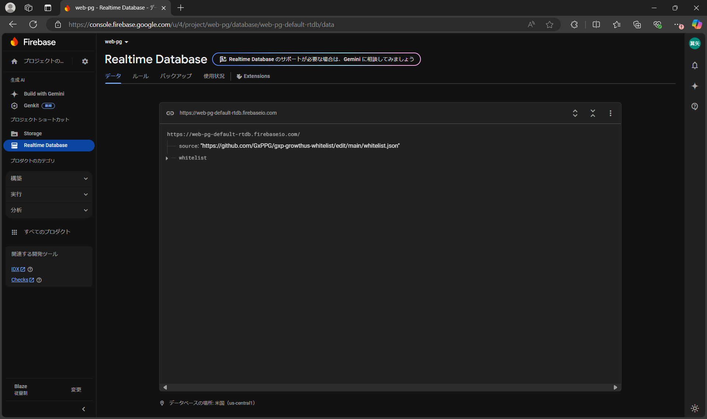
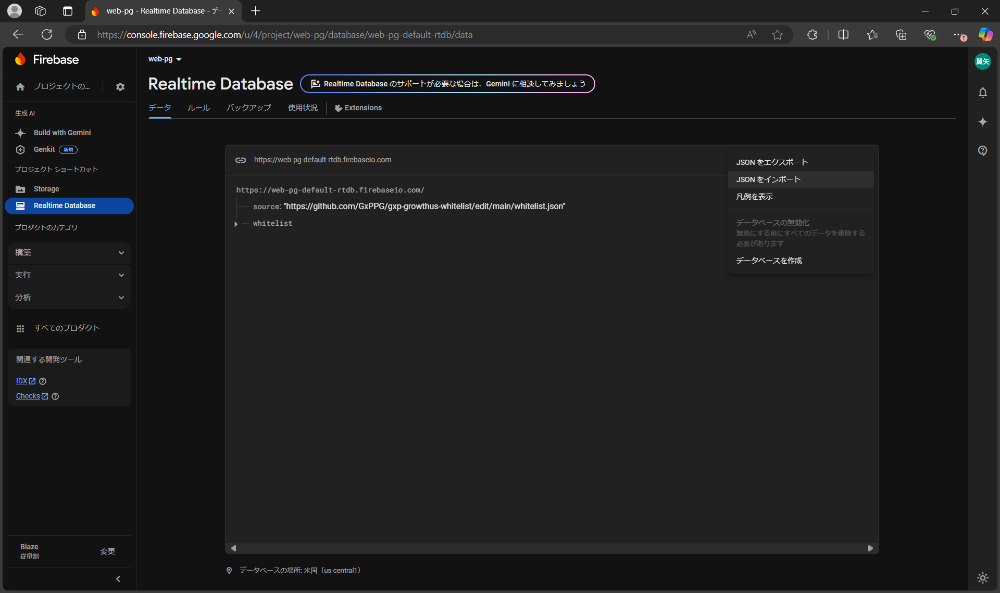
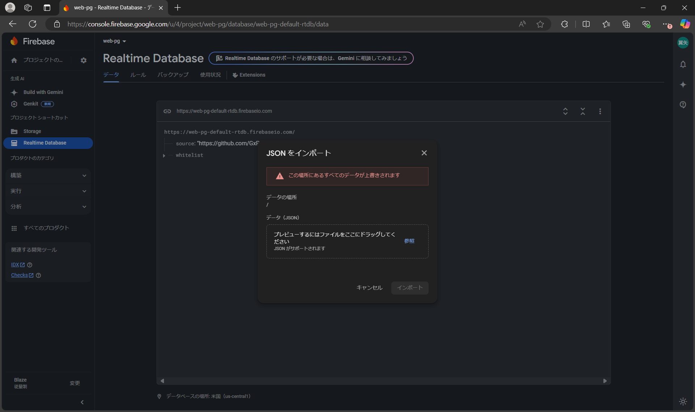
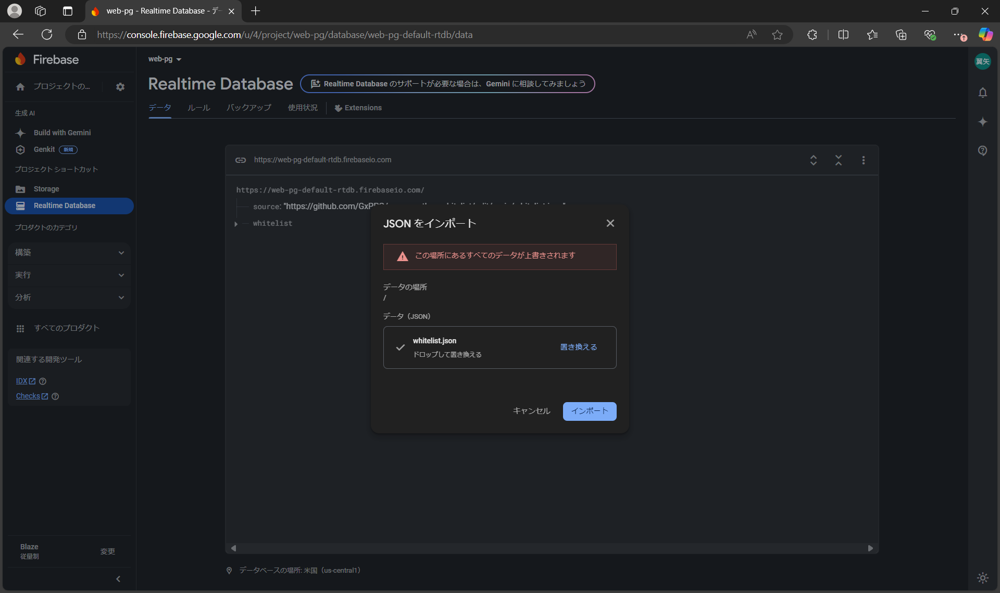
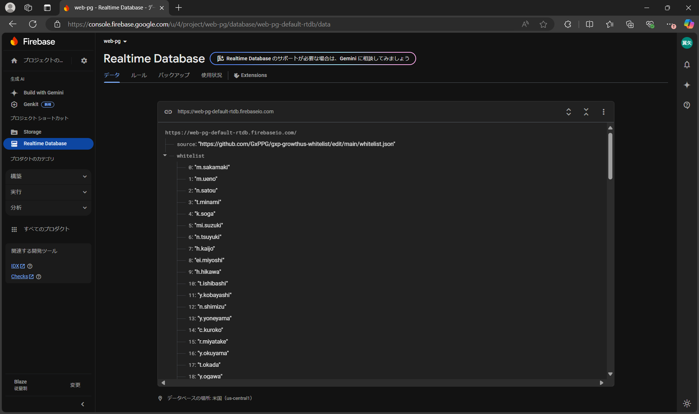

# ホワイトリスト更新手順

## 1. PRの作成

1. ホワイトリスト更新用のブランチを作成し、ユーザの追加
2. ブランチをプッシュし、PRを作成
3. レビューを受け承認を得る
4. PRをマージする

## 2. Firebase Realtime Databaseの更新

1. <https://console.firebase.google.com/u/4/project/web-pg/database/web-pg-default-rtdb/data> を開く
   
2. 三点リーダーから「JSON をインポート」を選択
   
3. whitelist.json のmainブランチ最新版を選択し、「インポート」を選択
   
   
4. whitelistを展開し、ユーザが追加されていることを確認
   
